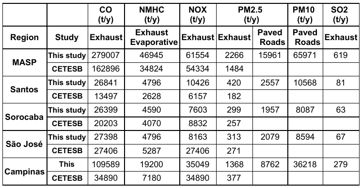

```{r setup, include=FALSE}
options(htmltools.dir.version = FALSE)
knitr::opts_chunk$set(
  fig.width=9, fig.height=3.5, fig.retina=3,
  out.width = "100%",
  cache = FALSE,
  echo = TRUE,
  message = FALSE, 
  warning = FALSE,
  hiline = TRUE
)
```

```{r xaringan-themer, include=FALSE, warning=FALSE}
library(xaringanthemer)
# style_duo_accent(
#   primary_color = "#1381B0",
#   secondary_color = "#FF961C",
#   inverse_header_color = "#FFFFFF"
# )
style_solarized_light()

library(sf)
library(ggplot2)
library(leaflet)
library(leaflet.providers)
library(cptcity)
library(stars)
library(raster)
library(magick)
library(data.table)
reg <- st_read("../../../papers/IBARRA/2021_Ibarra_Santos/shapefiles/regiones.shp")
# reg <- st_cast(reg, "LINESTRING")
cl <- st_read("../../../papers/IBARRA/2021_Ibarra_Santos/shapefiles/ne_50m_coastline.shp")
doms <- readRDS("doms.rds")
d1 <- doms[2, ]
doms <- st_cast(doms, "LINESTRING")
cl <- st_crop(cl, d1)
cl <- st_transform(cl, 4326)
```
class: center
## Introduction (Ibarra 2017)

```{r, echo = F, fig.cap="PhD thesis Ibarra 2017", out.height="65%", out.width="65%"}
knitr::include_graphics("esquema.png")
```


---

# Area of study
.pull-left[
```{r, echo = F, fig.height=7, fig.width=8}
doms <- readRDS("doms.rds")
doms <- st_cast(doms, "LINESTRING")
# mapview(doms, zcol = "dom")@map
pro <- get_providers()
leaflet(c(doms$X..i.., reg$geometry)) %>% 
  addPolylines() %>% 
  addProviderTiles(grep("Top", pro$providers, value = T)[[5]])
```

]
.pull-right[
| Metropolitan area               | Population |
|---------------------------------|------------|
| São Paulo                       | 21734682   |
| Campinas                        | 3264915    |
| Vale do Paraíba e Litoral Norte | 2552610    |
| Sorocaba                        | 2143789    |
| Baixada Santista                | 1865397    |
| Total                           | 31561393   |

- Industrial and economic center of Brazil
- Road transportation as the main source of pollutants in these urban areas (Andrade et al., 2012; CETESB, 2020).

]

---

# Objectives

#### 1. Estimate a bottom-up vehicular emissions inventory for the area of study
#### 2. Model air quality concentrations for dry and wet periods
#### 3. Investigate the direct and indirect aerosol effects

---
class: center, middle, inverse
# Data and methods

---
# GPS data


- 124 million observation of real-time GPS from https://maplink.global/.
- Data covers 1 week of **October 2014**.
- Covers Passenger Cars, Trucks, Taxi (99, Uber, etc) and not-identify.
- Data also from cars with policy insurance.
- Spatial bias with more records on richer areas.
- We generated a traffic flow corrected for spatial bias, as explained on Ibarra et al., 2019.

```{r, echo = F, fig.height=5, fig.width=5, fig.align='center'}

```


---

# Accumulated Precipitation from IMERG (mm)

.pull-left[
- **dry period**:  October 5-10, 2014
]
.pull-right[
- **wet period**: October 31st to November 5th, 2014
]

```{r, echo = F, fig.height=5, fig.width=5, fig.align='center'}
knitr::include_graphics("../../../papers/IBARRA/2021_Ibarra_Santos/figures_old/PLOT_IMERG.png")
```

---
# Emissions and air quality models


.pull-left[


<!-- {width=110px} {width=110px} -->

- R package with Fortran subroutines to estimate vehicular emissions.
- Consists in a fuel-calibrated inventory.
- Around 150 pollutants and emission factors from Europe, Brazil, EMFAC, adjusted with real-world measurements (Nogueira et al., 2021)
- Currently working in MOVES-VEIN integration with SQL.
- Includes methodoloy of Carter 2015 to generate groups for 10 chemical mechanisms.
- More details Ibarra-Espinosa et al., 2018, 2020
- Generates WRF Chemi NetCDF files with eixport (Ibarra-Espinosa et al., 2018b)
]

.pull-right[
```{r, echo = F, out.height="30%", out.width="30%", fig.align='center'}
knitr::include_graphics("https://ruc.noaa.gov/wrf/wrf-chem/wrfchem_logo.png")
```
- Probably the model most used to simulate air pollutant concentrations.
- Simulate meteorology and chemistry simultaneously.
- It is regional model, then suitable to modest computer power.
- **Google scholar returns 35400 results!**
- More details here Grell et al., 2005
]

---
# VEIN
[](http://cran.r-project.org/web/packages/vein) 
[](http://cran.r-project.org/package=vein)
[](https://www.tidyverse.org/lifecycle/#maturing)
[](https://github.com/atmoschem/vein)
[](https://github.com/atmoschem/vein/actions)


https://atmoschem.github.io/vein/

---
# 126 species for Brazilian conditions

```{r, echo = F, out.height="60%", out.width="100%", fig.align='center'}
df <- fread("~/Dropbox/buildvein/NMHC.csv")
df <- df[fuel %in% c("E25", "E100", "B5")]
df$fuel_process <- paste(df$fuel, df$eu)

ggplot(df, 
       aes(x = species, 
           y = x, 
           colour = eu, 
           group = eu)) +
  geom_point() +
  facet_grid(fuel~.) +
labs(y = NULL, x = NULL)+
theme(axis.text.x = element_text(angle = 90, hjust = 1, size = 7),
        legend.position = c(0.85, -0.8),
        legend.title = element_blank(),
      strip.text.y = element_text(angle = 0))
```


---
# WRF-Chem
```{r, echo = F, out.height="60%", out.width="60%", fig.align='center'}

```


---
class: center, middle, inverse
# Results

---
# Results - Emissions

.pull-left[
```{r, echo = F, out.height="100%", out.width="100%", fig.align='center'}

```

- Our estimation is higher than official from CETESB
- The spatial emissions shows great heterogeneity.
]


.pull-left[
```{r, echo = F, out.height="a80%", out.width="80%", fig.align='center'}

```

]

---
# Results - WRF

.pull-left[
```{r, echo = F, out.height="100%", out.width="100%", fig.align='center'}
knitr::include_graphics("/media/sergio/0A9AD66165F337622/MEGA/PhDgrive/Conferences/2021IGAC/oral/met_comp.png")
```
- No significant effect of aerosols feedback (wilcoxon test p.value > 0.05)
- Better results for Temperature, worst for Wind Speed.
]


.pull-left[
```{r, echo = F, out.height="100%", out.width="100%", fig.align='center'}
knitr::include_graphics("/media/sergio/0A9AD66165F337622/MEGA/PhDgrive/Conferences/2021IGAC/oral/pol_comp.png")
```
- Simulation cannot reach observation peaks.
- Simulation follow diurnal cycle and general trend.

]


---
# Aerosol effect on Downward shorwave flux 

```{r, echo = F, out.height="100%", out.width="100%", fig.align='center'}
knitr::include_graphics("/media/sergio/0A9AD66165F337622/MEGA/PhDgrive/Conferences/2021IGAC/oral/SWDOWN_per.png")
```

---
# Aerosol effect on surface $O_3$

```{r, echo = F, out.height="100%", out.width="100%", fig.align='center'}
knitr::include_graphics("/media/sergio/0A9AD66165F337622/MEGA/PhDgrive/Conferences/2021IGAC/oral/O3_per.png")
```

---
# Aerosol effect on Precipitation

```{r, echo = F, out.height="100%", out.width="100%", fig.align='center'}
knitr::include_graphics("/media/sergio/0A9AD66165F337622/MEGA/PhDgrive/Conferences/2021IGAC/oral/RAIN.png")
```


---
class: center, middle, inverse
# Discussion and conclusion

---
# Discussion and conclusion

#### 1. Estimate a bottom-up vehicular emissions inventory for the area of study
- First bottom-up vehicle emissions inventory for this area
- We need to incorporate missing sources to find the **true** emissions inventory and obtain more representative air quality simulations.

#### 2. Model air quality concentrations for dry and wet periods
- Simulations align with observations.
- We need to improve emission factors of $NO/NO_2$.
- We need to include critical PM sources, such as pizzerias and other restaurants that use wood and carbon combustion.

#### 3. Investigate the direct and indirect aerosol effects
- The effects of aerosols is very small, due to the, in general, low PM concentrations.
- We did find significant enhancement of precipitation in some small areas.
- The aerosol effect during dry periods decrease around 1.5% $O_3$ concentrations. Vara el tal.,2016, found 2%.
- However, we found increment of $O_3$ during wet period, probably because vertical advection.


---
# References

- Carter, William PL. 2015. “Development of a Database for Chemical Mechanism Assignments for Volatile Organic Emissions.” Journal of the Air & Waste Management Association 65 (10): 1171–84. 
- CETESB. 2020. “Emissões Veiculares No Estado de são Paulo 2019.” 
- Grell et al 2005. “Fully Coupled ‘Online’ Chemistry Within the WRF Model.” Atmospheric Environment 39 (37): 6957–75.
- Ibarra-Espinosa  et al . 2018. “VEIN V0.2.2: An r Package for Bottom–up Vehicular Emissions Inventories.” Geoscientific Model Development 11 (6): 2209–29. https://doi.org/10.5194/gmd-11-2209-2018. 
- Ibarra-Espinosa et al. 2020. “High Spatial and Temporal Resolution Vehicular Emissions in South-East Brazil with Traffic Data from Real-Time GPS and Travel Demand Models.” Atmospheric Environment 222: 117136. 
- Ibarra-Espinosa, Sergio, Rita Ynoue, Mariana Giannotti, Karl Ropkins, and Edmilson Dias de Freitas. 2019. “Generating Traffic Flow and Speed Regional Model Data Using Internet GPS Vehicle Records.” MethodsX 0 (March). 
- Nogueira et al. 2021. “Evolution of Vehicle Emission Factors in a Megacity Affected by Extensive Biofuel Use: Results of Tunnel Measurements in São Paulo, Brazil.” Environmental Science & Technology 55 (10): 6677–87.
- Vara-Vela et al. 2016. “Impact of Vehicular Emissions on the Formation of Fine Particles in the Sao Paulo Metropolitan Area: A Numerical Study with the WRF-Chem Model.” Atmospheric Chemistry and Physics 16 (2): 777– 97.
- Huffmanet al. 2015. "Day 1 IMERG final run release notes." NASA/GSFC: Greenbelt, MD, USA.


---
class: center, middle

.pull-left[
#### https://www.casap.com.co/en/pre-congress-courses/


]

.pull-right[
 
 - Poster ROOM 2.
 
 
 
# Thanks!

sergio.ibarra@usp.br

https://ibarraespinosa.github.io/

]
